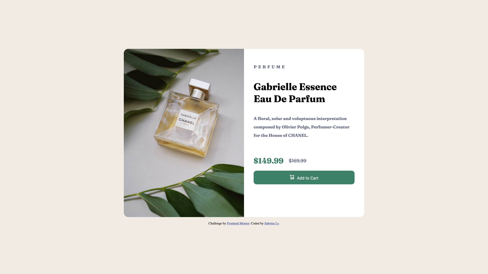
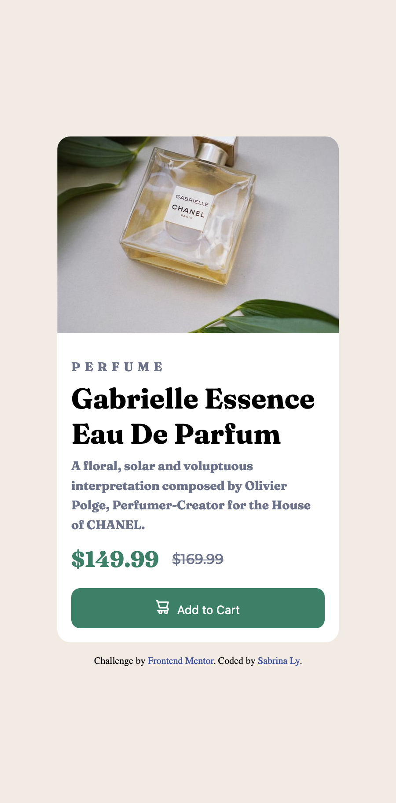

# Frontend Mentor - Product preview card component solution

This is a solution to the [Product preview card component challenge on Frontend Mentor](https://www.frontendmentor.io/challenges/product-preview-card-component-GO7UmttRfa). Frontend Mentor challenges help you improve your coding skills by building realistic projects.

## Table of contents

- [Overview](#overview)
  - [The challenge](#the-challenge)
  - [Screenshot](#screenshot)
  - [Links](#links)
- [My process](#my-process)
  - [Built with](#built-with)
  - [What I learned](#what-i-learned)
  - [Continued development](#continued-development)
  - [Useful resources](#useful-resources)
- [Author](#author)
- [Acknowledgments](#acknowledgments)

## Overview

### The challenge

Users should be able to:

- View the optimal layout depending on their device's screen size
- See hover and focus states for interactive elements

### Screenshot




As seen in the screenshots, the design is almost identical. The only issue is the Desktop view. I had issues working on the laying out of the product information. As aligning it was difficult and may be an issue of my HTML structure or CSS. The mobile version is fine.

### Links

- Solution URL: [GitHub](https://github.com/LySabrina/Product-Preview-Card)
- Live Site URL: [Live Site](https://your-live-site-url.com)

## My process

### Built with

- Semantic HTML5 markup
- CSS custom properties
- Flexbox
- CSS Grid
- Mobile-first workflow

### What I learned

The main focus of this project is to learn how to do responsive design. Responsive design is achieved through the use of media queries and using the `html 
<picture>` or the `html `. I first attempted to use the srcset and size but had issues getting the correct image for the Desktop view. On my laptop screen, it kept using the mobile photo but used the desktop photo on my bigger monitor. I struggled figuring out why though I suspect it is the issue of not fully understanding the size attribute. Hence, I decided to use the picture element which worked really well.

For the picture element, I have one soruce element that changes to the bigger desktop image if it's bigger than min-width:1440px. I at first used max-width: 375px but for sizes greater than that and less than 1440px, it looked strange using the desktop image. Hence, I change to the min-width:1440px as the condition instead.

```html
<picture>
  <source
    media="(min-width:1440px)"
    srcset="./images/image-product-desktop.jpg"
    class="product-image"
  />
  
</picture>
<!-- 
   -->
```

The final completion time of this project is about 4 hours.

### Continued development

I want to continue understanding Responsive design and responsive image. I think I understand how the `html <picture>` element works but not the `html <img srcset ="" size =""` well enough. I am confused on how the srcset and size works. I will need to study more and practice using that element.

Also I need to better figure out laying out my HTML structure or CSS. This is because going from mobile to desktop leaves the product information not formatted correctly.

Even though this project does not fully look like the desktop design, I am satsified.

### Useful resources

- [web.dev](https://web.dev/learn/design) - This helped me understand some basics of responsive design. It's a good introduction but not detailed enough.
- [Mozilla Responsive Design](https://developer.mozilla.org/en-US/docs/Learn/CSS/CSS_layout/Responsive_Design) - Good examples on picture and img.srcset

## Author

- Frontend Mentor - [@lysabrina](https://www.frontendmentor.io/profile/LySabrina)
- GitHub - [@lysabrina](https://github.com/LySabrina)

## Acknowledgments

Thanks Frontendmentor for these practice projects.
